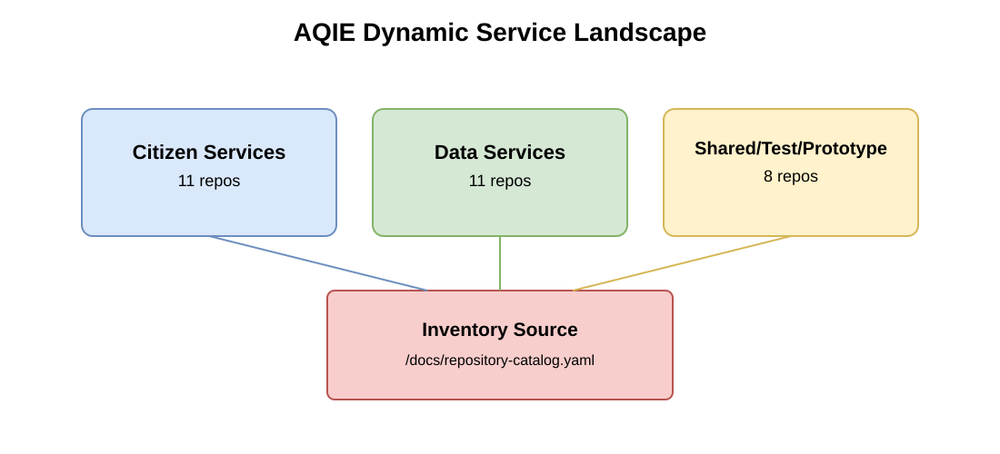

# aq-dynamic-documentation

Dynamic documentation library for Air Quality services.

## Table of Contents

- [Service Summary](#service-summary)
- [Repository Purpose](#repository-purpose)
- [What Is Dynamic Documentation?](#what-is-dynamic-documentation)
- [System Landscape Diagram](#system-landscape-diagram)
- [Start Here (New Users)](#start-here-new-users)
- [Documentation Map](#documentation-map)
- [How Updates Work](#how-updates-work)
- [Automation in This Repository](#automation-in-this-repository)
- [Security and Data Rules](#security-and-data-rules)
- [Conventions and Metadata](#conventions-and-metadata)

## Service Summary

This repository documents the AQIE Air Quality service estate across Citizen and Data domains, including service purpose, architecture context, technology notes, hosting details, and service relationships.

## Repository Purpose

This repository stores service documentation only (no source code, no sensitive data) and is designed for repeatable AI-assisted updates.

## What Is Dynamic Documentation?

“Dynamic documentation” means this library is continuously refreshable from repository metadata and merged `main` branch changes, so documentation stays current without manual re-discovery each time.

## System Landscape Diagram

Rendered preview:

Diagram files:

- Source XML: `/docs/diagrams/src/aqie-service-landscape.drawio`
- Rendered asset: `/docs/diagrams/export/aqie-service-landscape.svg`

## Start Here (New Users)

1. Read `/docs/introduction.md`
2. Review `/docs/master/system-landscape.md`
3. Open `/docs/repositories/aqie-repository-inventory.md` for current repo inventory
4. Inspect `/docs/repository-catalog.yaml` for metadata fields and update state
5. Explore domain folders under `/docs/services/citizen/` and `/docs/services/data/`
6. Review `/docs/workflows/dynamic-update-workflow.md` and `/docs/agent-instructions/dynamic-update-instructions.md`
7. Check `/docs/audit/audit-log.md` for historical update cycles

## Documentation Map

- `/docs/introduction.md` — repository scope and principles
- `/docs/master/system-landscape.md` — how all services fit together and data flow summary
- `/docs/repository-catalog.yaml` — tracked repositories and interrogation metadata
- `/docs/repositories/aqie-repository-inventory.md` — current AQIE inventory snapshot
- `/docs/services/citizen/overview.md` — Citizen domain overview
- `/docs/services/citizen/sub-services.md` — Citizen sub-service structure
- `/docs/services/data/overview.md` — Data domain overview
- `/docs/services/data/sub-services.md` — Data sub-service structure
- `/docs/services/_templates/service-profile-template.md` — reusable service profile template
- `/docs/diagrams/drawio-guidelines.md` — diagram governance and regeneration rules
- `/docs/audit/audit-log.md` — change history and audit trail

## How Updates Work

At a high level:

1. Check tracked repositories for merged updates on `main`
2. Refresh per-repository metadata (including activity status)
3. Update impacted domain/sub-service documents
4. Update master landscape and data-flow narratives
5. Regenerate diagrams
6. Record the run in the audit log

Detailed process: `/docs/workflows/dynamic-update-workflow.md`

## Automation in This Repository

- `/.github/workflows/refresh-aqie-repository-metadata.yml`
  - Refreshes AQIE repository metadata and regenerates:
    - `/docs/repository-catalog.yaml`
    - `/docs/repositories/aqie-repository-inventory.md`
- `/.github/workflows/regenerate-drawio-exports.yml`
  - Regenerates rendered diagram assets from `/docs/diagrams/src/*.drawio`

### Required Secret for Metadata Refresh

Add repository secret:

- `DEFRA_READONLY_PAT` — read-only token with DEFRA SSO authorization

## Security and Data Rules

- Documentation repository only
- No service source code
- No credentials/tokens/secrets in committed files
- Main branch analysis only (ignore feature branch/unmerged work)

## Conventions and Metadata

- Service type taxonomy includes:
  - Core Frontend Service
  - Core Backend Service
  - Auxilary Frontend
  - Auxilary Backend Service
  - Demo Service
  - Prototype Service (including PoC)
  - Quality/Test Service
  - Data/Analytics Support Service
- Connected services are marked provisional until confirmed
- Activity status is derived from latest default-branch head commit timestamp
