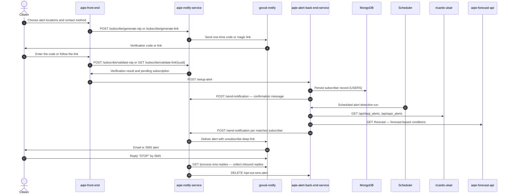

<!-- GENERATED FILE — DO NOT EDIT.
     Source: /docs/integration-catalog.yaml
     Regenerate: python3 scripts/generate_diagrams.py -->

# Citizen: air quality alert subscription and delivery

_Generated 2026-09-15T13:13:57Z from `/docs/integration-catalog.yaml`._

Subscription capture, verification, alert dispatch and opt-out. aqie-alert-back-end-service owns subscriber state; aqie-notify-service owns the messaging edge and is the only holder of the GOV.UK Notify key.

