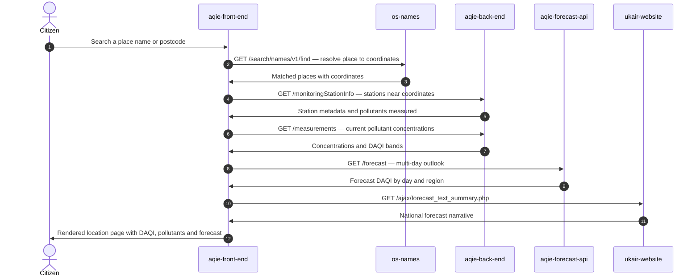

<!-- GENERATED FILE — DO NOT EDIT.
     Source: /docs/integration-catalog.yaml
     Regenerate: python3 scripts/generate_diagrams.py -->

# Citizen: check air quality for a location

_Generated 2026-09-15T13:13:57Z from `/docs/integration-catalog.yaml`._

The primary public journey on check-air-quality.service.gov.uk.

