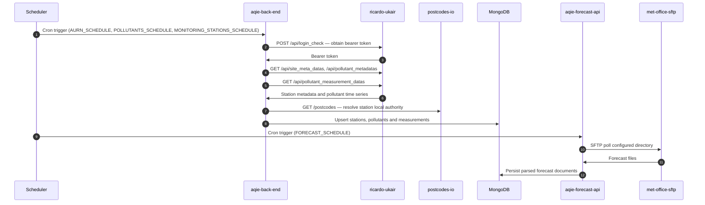

<!-- GENERATED FILE — DO NOT EDIT.
     Source: /docs/integration-catalog.yaml
     Regenerate: python3 scripts/generate_diagrams.py -->

# Scheduled air quality data ingestion

_Generated 2026-09-15T13:13:57Z from `/docs/integration-catalog.yaml`._

How measurement and forecast data enters the estate. Runs on cron schedules, not on user request.

