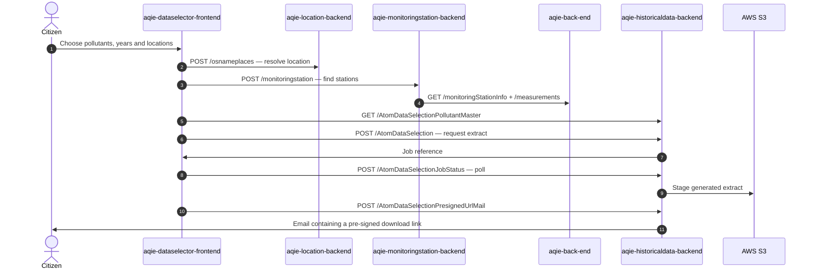

<!-- GENERATED FILE — DO NOT EDIT.
     Source: /docs/integration-catalog.yaml
     Regenerate: python3 scripts/generate_diagrams.py -->

# Citizen: download historic air quality data

_Generated 2026-09-15T13:13:57Z from `/docs/integration-catalog.yaml`._

Asynchronous extract journey — the citizen requests data and receives a download link by email.

