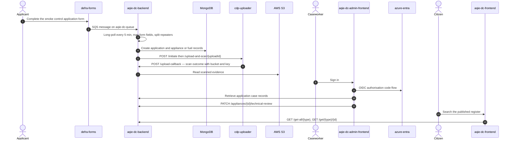

<!-- GENERATED FILE — DO NOT EDIT.
     Source: /docs/integration-catalog.yaml
     Regenerate: python3 scripts/generate_diagrams.py -->

# Smoke control: appliance and fuel applications

_Generated 2026-09-15T13:13:57Z from `/docs/integration-catalog.yaml`._

Applications arrive asynchronously from DEFRA Forms over SQS, not through the AQIE frontend. The public frontend is read-only search; the admin frontend is the caseworker review interface.

