<!-- GENERATED FILE — DO NOT EDIT.
     Source: /docs/integration-catalog.yaml
     Regenerate: python3 scripts/generate_diagrams.py -->

# AQIE Service-to-Service Dependencies

_Generated 2026-09-15T13:13:57Z from `/docs/integration-catalog.yaml`._

Internal AQIE edges only. External systems are excluded to keep the ownership boundary clear — see the system context diagram for those.

```mermaid
graph TD
  aqie_alert_back_end_service["alert-back-end-service"]
  aqie_back_end["back-end"]
  aqie_dataselector_frontend["dataselector-frontend"]
  aqie_dc_admin_frontend["dc-admin-frontend"]
  aqie_dc_backend["dc-backend"]
  aqie_dc_frontend["dc-frontend"]
  aqie_demo_data_visualisations["demo-data-visualisations"]
  aqie_docanalysisawspoc_frontend["docanalysisawspoc-frontend"]
  aqie_docanalysispoc_backend["docanalysispoc-backend"]
  aqie_docanalysispoc_frontend["docanalysispoc-frontend"]
  aqie_forecast_api["forecast-api"]
  aqie_front_end["front-end"]
  aqie_historicaldata_backend["historicaldata-backend"]
  aqie_location_backend["location-backend"]
  aqie_maps_frontend["maps-frontend"]
  aqie_maps_prototype["maps-prototype"]
  aqie_monitoringstation_backend["monitoringstation-backend"]
  aqie_notify_service["notify-service"]
  aqie_prtr_backend["prtr-backend"]
  aqie_prtr_frontend["prtr-frontend"]
  defra_forms["defra-forms"]
    aqie_front_end -->|"GET /measurements<br/>GET /monitoringStationInfo"| aqie_back_end
    aqie_front_end -->|"GET /forecast"| aqie_forecast_api
    aqie_monitoringstation_backend -->|"GET /monitoringStationInfo?with-closed=true&with-pollutants=1&stream=data"| aqie_back_end
    aqie_monitoringstation_backend -->|"POST /osnameplaces"| aqie_location_backend
    aqie_dataselector_frontend -->|"POST /AtomDataSelection<br/>POST /AtomDataSelectionJobStatus<br/>GET /AtomDataSelectionPollutantMaster<br/>POST /AtomDataSelectionPollutantDataSource<br/>+4 more"| aqie_historicaldata_backend
    aqie_dataselector_frontend -->|"POST /osnameplaces"| aqie_location_backend
    aqie_dataselector_frontend -->|"POST /monitoringstation"| aqie_monitoringstation_backend
    aqie_alert_back_end_service -.->|"GET /notify/unsubscribe-email-link"| aqie_front_end
    aqie_notify_service -->|"DELETE /opt-out-sms-alert"| aqie_alert_back_end_service
    aqie_dc_frontend -->|"GET /get-all/{type}<br/>GET /get/{type}/{id}"| aqie_dc_backend
    defra_forms -.->|"AWS SQS"| aqie_dc_backend
    aqie_dc_admin_frontend -->|"GET /applications/search<br/>PATCH /appliances/{id}/technical-review<br/>POST /admin/import/initiate"| aqie_dc_backend
    aqie_prtr_frontend -->|"GET /facilities/search<br/>GET /facilities/nearby<br/>GET /facilities/{id}/details<br/>GET /facilities/{id}/competent-authority<br/>+5 more"| aqie_prtr_backend
    aqie_prtr_backend -->|"POST /osnameplaces"| aqie_location_backend
    aqie_maps_frontend -->|"GET /monitoringStations<br/>GET /monitoringStationInfo<br/>GET /aurnData<br/>GET /forecasts"| aqie_back_end
    aqie_maps_frontend -->|"GET /forecast"| aqie_forecast_api
    aqie_demo_data_visualisations -->|"GET /measurements"| aqie_back_end
    aqie_docanalysisawspoc_frontend -->|"HTTPS/REST"| aqie_docanalysispoc_backend
    aqie_docanalysispoc_frontend -->|"HTTPS/REST"| aqie_docanalysispoc_backend
    aqie_front_end -->|"POST /setup-alert<br/>DELETE /opt-out-email-alert<br/>GET /aqsr-alert<br/>GET /daqi-alert"| aqie_alert_back_end_service
    aqie_front_end -->|"POST /subscribe/generate-otp<br/>POST /subscribe/validate-otp<br/>POST /subscribe/generate-link<br/>GET /subscribe/validate-link/{uuid}"| aqie_notify_service
    aqie_alert_back_end_service -->|"POST /send-notification"| aqie_notify_service
    aqie_alert_back_end_service ==>|"GET /forecast"| aqie_forecast_api
    aqie_notify_service -.->|"GET /notify/register/email-confirm-link"| aqie_front_end
    aqie_maps_prototype -->|"GET /monitoringStations<br/>GET /monitoringStationInfo<br/>GET /health"| aqie_back_end
    aqie_maps_prototype -->|"GET /forecast"| aqie_forecast_api
    aqie_historicaldata_backend -.->|"POST /send-notification"| aqie_notify_service
```

## Edge detail

| Source | Target | Interaction | Endpoints | Data exchanged | Confidence |
|---|---|---|---|---|---|
| `aqie-alert-back-end-service` | `aqie-forecast-api` | scheduled-batch | `GET /forecast` | Forecast DAQI values with station coordinates | `confirmed` |
| `aqie-alert-back-end-service` | `aqie-front-end` | user-redirect | `GET /notify/unsubscribe-email-link` | Email identifier carried as a query parameter | `confirmed` |
| `aqie-alert-back-end-service` | `aqie-notify-service` | synchronous | `POST /send-notification` | Recipient, Notify template id, personalisation and alertId out; notification id back | `confirmed` |
| `aqie-dataselector-frontend` | `aqie-historicaldata-backend` | synchronous | `POST /AtomDataSelection` `POST /AtomDataSelectionJobStatus` `GET /AtomDataSelectionPollutantMaster` `POST /AtomDataSelectionPollutantDataSource` `POST /AtomDataSelectionPresignedUrlMail` `POST /AtomEmailJobDataSelection` `POST /AtomHistoryHourlydata` `POST /AtomHistoryexceedence` | Selection criteria (pollutants, years, sites) in; extract job reference out Job reference in; job state out Master list of selectable pollutants Pollutant data sources available for selection Job reference in; pre-signed download URL issued by email Email delivery request for a completed extract Hourly historic measurement series Exceedence statistics for the selected criteria | `confirmed` |
| `aqie-dataselector-frontend` | `aqie-location-backend` | synchronous | `POST /osnameplaces` | Place-name query in; matches out | `confirmed` |
| `aqie-dataselector-frontend` | `aqie-monitoringstation-backend` | synchronous | `POST /monitoringstation` | Location in; nearby stations with pollutants out | `confirmed` |
| `aqie-dc-admin-frontend` | `aqie-dc-backend` | synchronous | `GET /applications/search` `PATCH /appliances/{id}/technical-review` `POST /admin/import/initiate` | Filter criteria in; application case records out Technical review decision payload Bulk import request | `confirmed` |
| `aqie-dc-frontend` | `aqie-dc-backend` | synchronous | `GET /get-all/{type}` `GET /get/{type}/{id}` | Register type in; full record set out Single register record | `confirmed` |
| `aqie-demo-data-visualisations` | `aqie-back-end` | synchronous | `GET /measurements` | Station list keyed by localSiteID with per-pollutant data | `confirmed` |
| `aqie-docanalysisawspoc-frontend` | `aqie-docanalysispoc-backend` | synchronous | — | — | `confirmed` |
| `aqie-docanalysispoc-frontend` | `aqie-docanalysispoc-backend` | synchronous | — | — | `confirmed` |
| `aqie-front-end` | `aqie-alert-back-end-service` | synchronous | `POST /setup-alert` `DELETE /opt-out-email-alert` `GET /aqsr-alert` `GET /daqi-alert` | Verified contact, location, coordinates, channel and language Email identifier; removes the subscription Air quality summary report breaches by day or date range DAQI alert content for coordinates on a given day | `confirmed` |
| `aqie-front-end` | `aqie-back-end` | synchronous | `GET /measurements` `GET /monitoringStationInfo` | Per-station pollutant concentrations and DAQI bands Monitoring station metadata, coordinates, pollutants measured | `confirmed` |
| `aqie-front-end` | `aqie-forecast-api` | synchronous | `GET /forecast` | Forecast DAQI values by day and region | `confirmed` |
| `aqie-front-end` | `aqie-notify-service` | synchronous | `POST /subscribe/generate-otp` `POST /subscribe/validate-otp` `POST /subscribe/generate-link` `GET /subscribe/validate-link/{uuid}` | Mobile number in; one-time code dispatched Code in; verification result and pending subscription out Email address in; magic link dispatched Link token in; pending subscription payload out | `confirmed` |
| `aqie-historicaldata-backend` | `aqie-notify-service` | asynchronous | `POST /send-notification` | Recipient email address, Notify template identifier, and the extract download link as personalisation | `confirmed` |
| `aqie-maps-frontend` | `aqie-back-end` | synchronous | `GET /monitoringStations` `GET /monitoringStationInfo` `GET /aurnData` `GET /forecasts` | Full station list for map plotting Detail for a selected station AURN network dataset Forecast fallback, used only when AQIE_FORECAST_API_URL is unset | `confirmed` |
| `aqie-maps-frontend` | `aqie-forecast-api` | synchronous | `GET /forecast` | Forecast DAQI values by day and region | `confirmed` |
| `aqie-maps-prototype` | `aqie-back-end` | synchronous | `GET /monitoringStations` `GET /monitoringStationInfo` `GET /health` | Station list for plotting Selected station detail Upstream availability probe | `confirmed` |
| `aqie-maps-prototype` | `aqie-forecast-api` | synchronous | `GET /forecast` | Forecast DAQI values | `confirmed` |
| `aqie-monitoringstation-backend` | `aqie-back-end` | synchronous | `GET /monitoringStationInfo?with-closed=true&with-pollutants=1&stream=data` | Full station metadata including closed sites and pollutant coverage | `confirmed` |
| `aqie-monitoringstation-backend` | `aqie-location-backend` | synchronous | `POST /osnameplaces` | Location query in; gazetteer matches out | `confirmed` |
| `aqie-notify-service` | `aqie-alert-back-end-service` | synchronous | `DELETE /opt-out-sms-alert` | { phoneNumber } in; opt-out confirmation out | `confirmed` |
| `aqie-notify-service` | `aqie-front-end` | user-redirect | `GET /notify/register/email-confirm-link` | Verification token carried as a query parameter | `confirmed` |
| `aqie-prtr-backend` | `aqie-location-backend` | synchronous | `POST /osnameplaces` | Place-name query in; matches out | `confirmed` |
| `aqie-prtr-frontend` | `aqie-prtr-backend` | synchronous | `GET /facilities/search` `GET /facilities/nearby` `GET /facilities/{id}/details` `GET /facilities/{id}/competent-authority` `GET /facilities/{id}/record/{year?}` `GET /facilities/{id}/record/{year}/lines/{lineId}` `GET /locations/search` `GET /reports` `GET /reports/get-download-link/{year}` | Search criteria in; matching facilities out Coordinates in; nearby facilities out Full facility detail record Regulating authority for the facility Facility release record; year optional, defaults to latest Individual release or transfer line detail Location search backing the facility finder Available annual dataset reports Year in; pre-signed S3 download link out | `confirmed` |
| `defra-forms` | `aqie-dc-backend` | asynchronous | — | meta.formSlug, meta.referenceNumber, meta.timestamp and data.main plus repeater blocks. Routed on formSlug 'get-a-solid-fuel-certified-for-use-in-smoke-control-areas'. | `confirmed` |
