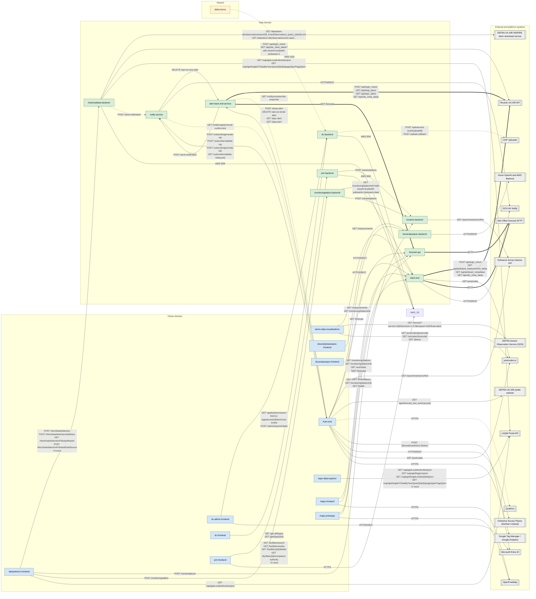

<!-- GENERATED FILE — DO NOT EDIT.
     Source: /docs/integration-catalog.yaml
     Regenerate: python3 scripts/generate_diagrams.py -->

# AQIE System Context

_Generated 2026-09-15T13:13:57Z from `/docs/integration-catalog.yaml`._

Every AQIE service with a confirmed integration, grouped by domain, with the external and platform systems they depend on. Edge labels show the endpoints used.

Arrow meaning: solid = synchronous request, thick = scheduled batch, dotted = asynchronous or user-redirect.

