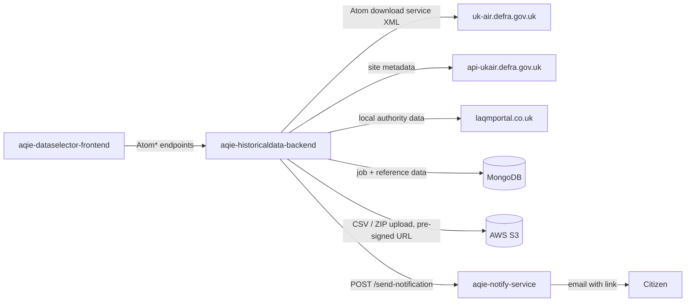

# aqie-historicaldata-backend

> The engine behind the historic air quality data download journey. It fetches measurement
> series on demand from the DEFRA UK-AIR Atom download service, builds CSV and ZIP extracts,
> stores them in S3, and issues pre-signed download links — either straight back to the
> browser or by email for long-running extracts.

## 1. Service Metadata

| Field | Value |
|---|---|
| Repository | [`DEFRA/aqie-historicaldata-backend`](https://github.com/DEFRA/aqie-historicaldata-backend) |
| Service domain | `Data` |
| Service type | `Auxilary Backend Service` |
| Lifecycle stage | `Production` |
| Primary language | C# |
| Runtime | .NET 8 (`net8.0`), ASP.NET Core minimal APIs |
| Default branch | `main` |
| Created (UTC) | `2025-02-24` |
| Last main commit (UTC) | `2026-09-09T12:25:08Z` |
| Last analysed commit | `83bc0366` |
| Last analysed (UTC) | `2026-09-15T00:00:00Z` |
| Activity status | `Active` |

## 2. Purpose and Responsibilities

**Does:**

- Serves the historic data selection journey for `aqie-dataselector-frontend` through ten
  `Atom*` minimal-API endpoints.
- **Fetches source measurements on demand** from the DEFRA UK-AIR INSPIRE Atom download
  service — see Section 7, "How this service gets its data", which answers catalogue open
  question `oq-002`.
- Resolves which monitoring sites are relevant to a selection. For the AURN network it
  authenticates to the Ricardo UK-AIR API and reads site metadata; for non-AURN networks it
  reads a station master list held in MongoDB.
- Filters sites geographically. It carries GeoJSON boundary files for England, Scotland,
  Wales and Northern Ireland and uses `NetTopologySuite` with `ProjNET` coordinate
  transformation to test whether a site falls inside the requested region.
- Resolves local authority areas and their monitoring data from the LAQM portal API,
  converting OS grid eastings and northings to latitude and longitude.
- Aggregates raw hourly observations into hourly, daily or annual CSV exports, and packages
  multi-site data selections as ZIP archives.
- Runs extracts as **asynchronous jobs**. A job is written to MongoDB, processed on a
  background channel, and its state is pollable.
- Uploads completed extracts to S3 and generates a pre-signed download URL valid for seven
  days.
- Runs a background service that picks up pending email jobs on an interval and asks
  `aqie-notify-service` to email the citizen a link to their completed extract.
- Seeds pollutant and station reference data into MongoDB from spreadsheets held in S3 on
  startup.
- Calculates exceedence statistics for a selection.

**Does not:**

- Serve current or near-real-time air quality. Today's concentrations and DAQI are
  `aqie-back-end`; the forecast is `aqie-forecast-api`.
- Store the historic measurements themselves. It holds job state and reference data only —
  the measurement series are re-fetched from UK-AIR for each extract.
- Resolve place names. `aqie-dataselector-frontend` calls `aqie-location-backend` and
  `aqie-monitoringstation-backend` for that before it ever reaches this service.
- Send email itself. It has no GOV.UK Notify credentials; it delegates to
  `aqie-notify-service`.
- Render any user interface — that is `aqie-dataselector-frontend`.
- Manage alert subscriptions — that is `aqie-alert-back-end-service`.

## 3. Architecture

**Pattern:** ASP.NET Core minimal API with two hosted background services, an in-process job
queue backed by MongoDB job documents, and S3 as the artefact store.

| Component | Path | Responsibility |
|---|---|---|
| Endpoint registration | `Atomfeed/Endpoints/AtomHistoryEndpoints.cs` | Maps all ten `Atom*` routes |
| Facade | `Atomfeed/Services/AtomHistoryService.cs` | Single entry point the endpoints call; dispatches to the specialist services |
| Atom fetch base | `Atomfeed/Services/AtomFeedFetchServiceBase.cs` | Builds the UK-AIR Atom path, handles 304/404/428, parses the XML |
| Fetch services | `AtomHourlyFetchService`, `AtomDailyFetchService`, `AtomAnnualFetchService`, `AtomDataSelectionHourlyFetchService` | Period-specific fetch and aggregation |
| Feed parsing | `Atomfeed/Services/AtomFeedHelper.cs` | OM/SWE observation parsing, pollutant identifier extraction |
| Station resolution | `AtomDataSelectionStationService` (also hosts `AuthService`) | Ricardo authentication, AURN site metadata, non-AURN site lookup, job queue |
| Geography | `AtomDataSelectionStationBoundryService`, `GeoBoundaries/*.geojson` | Region containment tests |
| Local authorities | `AtomDataSelectionLocalAuthoritiesService` | LAQM portal calls and grid-reference conversion |
| CSV export | `HourlyAtomFeedExportCSV`, `DailyAtomFeedExportCSV`, `AnnualAtomFeedExportCSV`, `DataSelectionHourlyAtomFeedExportCSV` | CSV generation via `CsvHelper` |
| S3 | `AWSS3BucketService`, `AWSPreSignedURLService` | Upload and pre-signed URL generation |
| Job state | `AtomDataSelectionJobStatus` | Reads job documents from MongoDB |
| Email jobs | `AtomDataSelectionEmailJobService`, `AtomDataSelectionEmailJobHostedService` | Interval-driven processing of pending email jobs |
| Reference seeding | `AtomDataSelectionNonAurnNetworks`, `AtomNonAurnNetworksSeedHostedService` | Loads spreadsheets from S3 into MongoDB on startup |
| Exceedences | `HistoryexceedenceService` | Exceedence statistics |
| Platform utilities | `Utils/Mongo/`, `Utils/Http/ProxyHttpMessageHandler.cs`, `Utils/TrustStore.cs`, `Utils/Logging/CdpLogging.cs` | CDP conventions |
| Example scaffold | `Example/` | CDP template sample, still registered — see Section 11 |

### The extract job lifecycle

1. The frontend posts a selection to `AtomDataSelection`.
2. For a count request the service returns a station or network count immediately.
3. For a download request it creates a job document in `aqie_csvexport_jobs` and queues the
   work on an unbounded in-process channel, returning a job reference.
4. The worker resolves the relevant sites, fetches one Atom feed per site and year from
   UK-AIR, maps observations to pollutants, and builds the CSV or ZIP.
5. The artefact is uploaded to S3 under a key derived from the selection, and a pre-signed URL
   valid for `604800` seconds (seven days) is generated and written back onto the job.
6. The frontend polls `AtomDataSelectionJobStatus` with the job reference until the state is
   terminal, then uses the result URL.
7. For extracts too slow to wait for, `AtomEmailJobDataSelection` records an email job in
   `aqie_csvemailexport_jobs`. The hosted email service wakes on an interval
   (`TIME_INTERVAL`, default 45 minutes), regenerates the pre-signed URL, and posts to
   `aqie-notify-service` `POST /send-notification` with the recipient address, a Notify
   template identifier and the link as personalisation. The job is then marked complete or
   failed with a reason.

> Because the in-process channel is per-container, a queued job is bound to the container that
> accepted it. Job state itself is durable in MongoDB. See Section 11.

## 4. API Surface

Routes are registered without a leading slash in `AtomHistoryEndpoints.cs`, which ASP.NET Core
maps to the paths below.

| Method | Path | Purpose | Request | Response |
|---|---|---|---|---|
| `GET` | `/health` | Liveness probe (ASP.NET Core health checks) | — | Health status |
| `GET` / `POST` | `/AtomHistoryHourlydata` | Hourly historic measurement series for a site and year | Selection criteria | Measurement rows, or 404 |
| `POST` | `/AtomHistoryexceedence` | Exceedence statistics for a selection | Selection criteria | Exceedence summary, or 404 |
| `POST` | `/AtomDataSelection` | Station/network count, or start an extract job | Pollutant, year, region, region type, data source, filter type, download type | Count, network breakdown, or a job reference |
| `POST` | `/AtomDataSelectionJobStatus` | Poll an extract job | Job reference | Job state, result URL, error reason, created/updated/start/end timestamps |
| `POST` | `/AtomEmailJobDataSelection` | Request delivery of a completed extract by email | Job and recipient details | Acceptance result |
| `POST` | `/AtomDataSelectionPresignedUrlMail` | Regenerate the pre-signed URL for an email job | Job reference | Pre-signed download URL |
| `POST` | `/AtomDataSelectionNonAurnNetworks` | Non-AURN network list | Selection criteria | Available networks |
| `GET` | `/AtomDataSelectionPollutantMaster` | Master list of selectable pollutants | — | Pollutant master records |
| `POST` | `/AtomDataSelectionPollutantDataSource` | Data sources available for a pollutant | Pollutant | Data source records |
| `GET` | `/example`, `/example/{id}` | CDP template scaffold — not part of the service contract | — | Sample documents |

Handlers catch broadly and return `404 Not Found` on error, so a downstream failure is not
distinguishable from an empty result. See Section 11.

## 5. Consumes (Outbound Dependencies)

| Target | Type | Endpoint / Mechanism | Data exchanged | Auth |
|---|---|---|---|---|
| DEFRA UK-AIR Atom download service | External API | `GET /data/atom-dls/observations/auto/GB_FixedObservations_{year}_{siteID}.xml` and `.../non-auto/...` | INSPIRE/OM-SWE observation XML — the actual historic measurements | None (public) |
| Ricardo UK-AIR API | External API | `POST /api/login_check`, then `GET /api/site_meta_datas?with-closed=true&with-pollutants=1` | Credentials exchanged for a bearer token; AURN site metadata and pollutant coverage out | `RICARDO_API_KEY` / `RICARDO_API_VALUE` |
| LAQM portal API | External API | `GET /xapi/getLocalAuthorities/json`, `GET /xapi/getSingleDTDataByYear/{year}/{laId}/{page}/{perPage}/json` | Local authority list and diffusion tube data with OS grid references | `X-API-Key` and `X-API-PartnerId` headers (`LAQM_API_KEY`, `LAQM_USERID`) |
| `aqie-notify-service` | `AQIE service` | `POST /send-notification` (`NOTIFY_BASEADDRESS` + `NOTIFY_URL`) | Recipient email address, Notify template identifier, and the extract download link as personalisation | CDP internal network — **not yet in the integration catalogue, see Section 11** |
| AWS S3 | Datastore | `GetObject`, `TransferUtility` upload, `GetPreSignedURL` | Reference spreadsheets in; CSV and ZIP extracts out; pre-signed URLs issued | IAM role via the AWS SDK |
| MongoDB | Datastore | `MongoDB.Driver` | Job documents and seeded reference collections | `Mongo:DatabaseUri` (MONGODB-AWS authentication) |

## 6. Consumed By (Inbound Dependencies)

| Consumer | Endpoint used | Data exchanged |
|---|---|---|
| `aqie-dataselector-frontend` | `POST /AtomDataSelection`, `POST /AtomDataSelectionJobStatus`, `GET /AtomDataSelectionPollutantMaster`, `POST /AtomDataSelectionPollutantDataSource`, `POST /AtomDataSelectionPresignedUrlMail`, `POST /AtomEmailJobDataSelection`, `GET /AtomHistoryHourlydata`, `POST /AtomHistoryexceedence` | Drives the whole historic data selection and download journey |

> Edges are mastered in [`/docs/integration-catalog.yaml`](../../../integration-catalog.yaml).
>
> `POST /AtomDataSelectionNonAurnNetworks` is exposed but is not among the endpoints recorded
> for `aqie-dataselector-frontend` in the catalogue.

## 7. Data

### How this service gets its data — catalogue open question `oq-002`

**It is not fed from `aqie-back-end`, and it does not run its own measurement ingest pipeline.
It pulls measurements on demand, per request, from the public DEFRA UK-AIR INSPIRE Atom
download service.**

The evidence is the named `Atomfeed` HTTP client registered in `Program.cs` with a base
address of `uk-air.defra.gov.uk`, and `AtomFeedFetchServiceBase.FetchAtomFeedAsync`, which
builds a path of the form
`data/atom-dls/observations/{auto|non-auto}/GB_FixedObservations_{year}_{siteID}.xml`. The
`auto` branch is used for AURN and the `non-auto` branch for other networks. The response is
INSPIRE Air Quality XML containing OGC `om:OM_Observation` members; the service extracts the
observed-property identifier, matches it against its pollutant master list, and splits the
SWE data array into rows.

The only other upstream sources are **metadata, not measurements**: the Ricardo UK-AIR API
supplies AURN site metadata and pollutant coverage so the service knows which sites to ask
UK-AIR for, and the LAQM portal supplies local authority information.

Practical consequences worth recording:

- There is **no stored measurement history** in this service. Every extract re-fetches from
  UK-AIR, which is why extracts are asynchronous jobs and why a timing log file is committed
  in the repository.
- Availability of historic data is entirely governed by UK-AIR. A missing site-year simply
  returns 404 and yields an empty array rather than an error.
- The service and `aqie-back-end` can legitimately disagree, because they read the same
  underlying network through two different publication routes.

### Stores

- **MongoDB** (`Mongo:DatabaseName`, `aqie-historicaldata-backend`):
  - `aqie_csvexport_jobs` — extract job documents: job reference, status, result URL, error
    reason, created/updated/start/end timestamps. Indexed on job reference.
  - `aqie_csvemailexport_jobs` — email delivery jobs: the above plus recipient, mail-sent flag
    and the selection criteria needed to rebuild the S3 key.
  - `aqie_atom_non_aurn_networks_pollutant_master` — pollutant master reference data.
  - `aqie_atom_non_aurn_networks_station_details` — non-AURN station reference data.
  - `aqie_atom_seed_locks` — a single lock document with a ten-minute TTL, ensuring only one
    container performs the startup reference-data seed.
- **AWS S3** (`S3_BUCKET_NAME`): generated CSV and ZIP extracts, plus the source reference
  spreadsheets identified by `POLLUTANT_MASTER_KEY` and `POLLUTANT_STATION_MASTER_KEY`.
- **Bundled files:** four GeoJSON country boundary files under `GeoBoundaries/`.

### Retention and refresh

- Reference collections are **dropped and rebuilt** from the S3 spreadsheets by the seeding
  hosted service on startup, then given a unique compound index. The seed takes a MongoDB
  lock first so that only one container in the ECS service does the work.
- Pre-signed extract URLs expire after seven days.
- Email jobs are swept on the `TIME_INTERVAL` cadence, default 45 minutes.
- No retention policy is expressed in code for job documents or for the S3 extract objects.
  See Section 11.

## 8. Configuration

.NET configuration comes from `appsettings.json` plus environment variables. Names only —
values are held in CDP secrets and never recorded here.

### `appsettings.json` keys

| Key | Purpose |
|---|---|
| `Mongo:DatabaseUri` | MongoDB connection string, injected at deployment (`MONGODB-AWS` auth mechanism) |
| `Mongo:DatabaseName` | Database name |
| `TraceHeader` | Name of the CDP trace header to propagate |
| `AllowedHosts` | ASP.NET Core host filtering |
| `Serilog:*` | Log levels and the Elastic Common Schema console formatter |

### Environment variables

| Variable | Purpose |
|---|---|
| `Environment` | CDP environment, interpolated into the `aqie-notify-service` base address |
| `SERVICE_VERSION` | Injected by CDP, added to log context |
| `HTTP_PROXY` | CDP egress proxy used by `ProxyHttpMessageHandler` for every outbound client |
| `RICARDO_API_KEY`, `RICARDO_API_VALUE` | Ricardo UK-AIR credentials exchanged at `api/login_check` |
| `LAQM_API_KEY`, `LAQM_USERID` | LAQM portal `X-API-Key` and `X-API-PartnerId` headers |
| `NOTIFY_BASEADDRESS`, `NOTIFY_URL` | `aqie-notify-service` base address and notification path |
| `EMAIL_TEMPLATEID` | GOV.UK Notify template identifier passed through to the notify service |
| `EMAIL_BASEADDRESS` | Prefix for the download link placed in the email |
| `TIME_INTERVAL` | Minutes between email job sweeps |
| `S3_BUCKET_NAME` | Extract and reference data bucket |
| `POLLUTANT_MASTER_KEY`, `POLLUTANT_STATION_MASTER_KEY` | S3 keys of the reference spreadsheets |
| `TRUSTSTORE_*` | Base64 certificates loaded into the custom trust store at startup |

> `RICARDO_API_KEY` and `RICARDO_API_VALUE` actually hold an email address and a password, not
> an API key. See Section 11.

## 9. Hosting and Deployment

- **Platform:** DEFRA Core Delivery Platform (CDP) on AWS ECS.
- **Target framework:** `net8.0` for both the application and test projects.
- **Container:** multi-stage build from `mcr.microsoft.com/dotnet/sdk:8.0` to
  `mcr.microsoft.com/dotnet/aspnet:8.0`; entrypoint `dotnet AqieHistoricaldataBackend.dll`.
  Ports 80, 443 and 8085 are exposed.
- **Internal address:** `https://aqie-historicaldata-backend.<env>.cdp-int.defra.cloud`.
- **Environments:** `dev`, `test`, `perf-test`, `prod`. A separate
  `aqie-historicaldata-perf-backend` repository exists for performance testing and is archived.
- **Startup order:** the custom trust store is loaded before any MongoDB or HTTP client is
  created, as certificate loading must precede connection setup.
- **Egress:** every named HTTP client is configured with `ProxyHttpMessageHandler` and GZip
  and Deflate decompression, so all outbound traffic goes through the CDP proxy.
- **AWS:** the S3 client is registered through `AWSSDK.Extensions.NETCore.Setup`, with the
  `eu-west-2` region pinned explicitly only in Development.
- **Local development:** `compose.yml` provides LocalStack, Redis and MongoDB.
- **Testing:** `xunit` against a full `WebApplication` backed by an ephemeral in-memory
  MongoDB, per the repository README.
- **Pipelines:**
  - `.github/workflows/check-pull-request.yml` — build, test and SonarCloud on PR
  - `.github/workflows/publish.yml` — build and publish on push
  - `.github/workflows/publish-hotfix.yml` — manual hotfix publish
  - `.github/workflows/sonarcloud.yml` — reusable SonarCloud workflow

## 10. Observability

- **Logging:** `Serilog` configured through `CdpLogging`, writing to console with the
  `Elastic.CommonSchema.Serilog` ECS formatter. Enrichers add client information, environment
  and `SERVICE_VERSION`. Logging is heavily used to trace fetch durations across the Atom feed
  calls.
- **Tracing:** `Microsoft.AspNetCore.HeaderPropagation` forwards the header named by the
  `TraceHeader` configuration key onto every outbound HTTP client.
- **Health:** ASP.NET Core health checks at `/health`. The codebase additionally contains an
  Atom feed reachability check that requests a fixed site and year from UK-AIR.
- **Metrics:** none beyond platform defaults. Unlike the Node services in this estate, there
  is no CloudWatch EMF instrumentation.

## 11. Open Questions

- [ ] **`oq-002` is answered** (Section 7): measurements are pulled on demand from the UK-AIR
      Atom download service, not from `aqie-back-end`. The catalogue should be updated to
      record `aqie-historicaldata-backend -> uk-air.defra.gov.uk` and to close the question.
- [ ] The `aqie-historicaldata-backend -> aqie-notify-service` edge (`POST /send-notification`)
      is evidenced in code but is **missing from the integration catalogue** and should be
      added. The same applies to the Ricardo UK-AIR and LAQM portal edges.
- [ ] `RICARDO_API_KEY` and `RICARDO_API_VALUE` hold an email address and password. Confirm
      these can be renamed to something accurate, and that they are the same Ricardo account
      used by `aqie-back-end` and `aqie-alert-back-end-service`.
- [ ] `aqie-back-end` defaults to a Ricardo staging host while this service uses
      `api-ukair.defra.gov.uk`. Confirm which is authoritative for production.
- [ ] Extract jobs are queued on an in-process channel, so a job is tied to the container that
      accepted it. Confirm what happens to in-flight jobs on deployment or container
      replacement, and whether the job documents are re-driven.
- [ ] No retention policy is expressed for `aqie_csvexport_jobs`, `aqie_csvemailexport_jobs`
      or the S3 extract objects. Confirm the agreed retention and whether an S3 lifecycle rule
      is configured outside the repository.
- [ ] Endpoint handlers return `404` for any exception. Confirm whether the frontend can
      distinguish a genuine empty result from an upstream failure.
- [ ] The CDP `Example` module is still registered, despite the source comment instructing its
      removal before deployment. Confirm it can be removed.
- [ ] Two `fetch_duration_log` text files are committed in the application directory. Confirm
      they are diagnostic leftovers and can be deleted.
- [ ] Is the seven-day pre-signed URL expiry the agreed policy for citizen data extracts?
