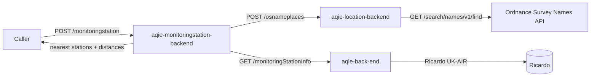

# aqie-monitoringstation-backend

> An aggregator. Given a place name and a search radius it calls `aqie-location-backend` to
> resolve the place to coordinates and `aqie-back-end` for the monitoring station dataset,
> then joins the two to return the nearest stations with their distances and the pollutants
> they measure.

## 1. Service Metadata

| Field | Value |
|---|---|
| Repository | [`DEFRA/aqie-monitoringstation-backend`](https://github.com/DEFRA/aqie-monitoringstation-backend) |
| Service domain | `Data` |
| Service type | `Auxilary Backend Service` |
| Lifecycle stage | `Production` |
| Primary language | JavaScript |
| Runtime | Node.js `>=22` (ES modules) |
| Default branch | `main` |
| Created (UTC) | `2025-02-14` |
| Last main commit (UTC) | `2026-03-18T12:21:35Z` |
| Last analysed commit | `44673322` |
| Last analysed (UTC) | `2026-09-15T00:00:00Z` |
| Activity status | `Monitoring` |

## 2. Purpose and Responsibilities

This service owns **one composite question**: *"which air quality monitoring stations are
within N miles of this place, and what do they measure?"* It holds no data of its own. Its
entire value is the aggregation.

**Does:**

- Accepts a place name and a radius in miles on `POST /monitoringstation`.
- **Fan-out step 1:** calls `aqie-location-backend` `POST /osnameplaces` to resolve the place
  name to Ordnance Survey gazetteer matches with coordinates.
- **Fan-out step 2:** calls `aqie-back-end` `GET /monitoringStationInfo` with
  `with-closed=true&with-pollutants=1&stream=data` to retrieve the full station dataset,
  including closed sites and their pollutant metadata.
- Normalises the station payload: maps the verbose upstream pollutant descriptions (which
  arrive with HTML subscript markup) onto short codes such as `PM25`, `GR10U`, `NO2`, `O3` and
  `SO2`, and converts `dd/mm/yyyy` operating dates to ISO form.
- **Join step:** orders stations by geodesic distance from the resolved coordinates using
  `geolib`, keeps those inside the requested radius, and computes each station's distance.
- Filters out stations with no usable pollutants, and drops pollutants whose measurement
  period ended before 2018.
- Applies display-friendly aliases (`PM25` becomes `PM2.5`, `NO2` becomes `Nitrogen dioxide`,
  and so on), sorts the result nearest-first and orders each station's pollutant list into the
  standard PM2.5, PM10, NO2, ozone, sulphur dioxide sequence.
- Reverses the upstream `areaType` wording into the form the front end expects.

**Does not:**

- Call Ordnance Survey directly. It always goes through `aqie-location-backend`, which owns
  the OS API key. Despite the `/osnameplaces` route name and the `OSPlace_API_URL` variable,
  this service is a client of that API, not a provider of it.
- Call the Ricardo UK-AIR API directly, despite the `RICARDO_API_URL` variable name. That
  variable points at `aqie-back-end`, which is the service that actually talks to Ricardo. The
  naming is a legacy artefact — see Section 11.
- Ingest, store or refresh any station or measurement data. Every request is served from live
  upstream calls.
- Serve historic time series or extracts — that is `aqie-historicaldata-backend`.
- Calculate DAQI. It passes through what `aqie-back-end` provides.

## 3. Architecture

**Pattern:** Stateless Hapi HTTP aggregator. One inbound request triggers two outbound calls
and an in-memory spatial join. No cache, no persistence, no scheduled work.

| Component | Path | Responsibility |
|---|---|---|
| Routes | `src/api/location/index.js` | Registers `POST /monitoringstation` and `GET /osnameplaces` |
| Controller | `src/api/location/controllers/location.js` | Response shaping and security headers |
| Orchestration | `src/api/location/helpers/get-osplace-util.js` | Input validation, miles-to-metres conversion, sequencing the join |
| Fan-out | `src/api/location/helpers/fetch-data.js` | The two upstream calls |
| Normalisation | `src/api/location/helpers/frame-siteinfo-data.js` | Maps upstream pollutant names to codes, normalises dates |
| Spatial join | `src/api/location/helpers/get-nearest-location.js` | Distance ordering, radius filter, pollutant filtering and aliasing |
| Geometry helpers | `src/api/location/helpers/location-util.js` | Coordinate conversion and range tests |
| Health | `src/api/health/index.js` | Liveness endpoint |
| Config | `src/config/index.js` | `convict` schema |
| Common helpers | `src/api/common/helpers/` | MongoDB, proxy, logging, metrics, tracing, secure context |

### Failure behaviour

Both upstream calls are made through a `catchFetchError` helper that returns an error instead
of throwing. An upstream failure is logged and then flows on as an undefined payload, which
results in an empty station list rather than a 5xx. Callers therefore cannot distinguish "no
stations near here" from "`aqie-back-end` was unavailable" from the response alone. This is
worth confirming with the owner — see Section 11.

## 4. API Surface

| Method | Path | Purpose | Request | Response |
|---|---|---|---|---|
| `GET` | `/health` | Liveness probe | — | Status payload |
| `POST` | `/monitoringstation` | Nearest monitoring stations to a place | JSON body with `userLocation` and `usermiles` | `{ message: 'success', getmonitoringstation }` — stations sorted nearest-first with `region`, `siteType`, `localSiteID`, GeoJSON `location`, `id`, `name`, `updated`, `distance` and an ordered `pollutants` map |
| `GET` | `/osnameplaces` | Same handler as above, bound to a `GET` | Reads `request.payload`, so in practice returns the empty-input result | As above |

> `GET /osnameplaces` shares the `POST /monitoringstation` handler and reads its input from
> the request payload, which a `GET` does not normally carry. Treat `POST /monitoringstation`
> as the real contract. A third route, `GET /monitoringstation/location={userLocation}`, is
> commented out in the source.

## 5. Consumes (Outbound Dependencies)

| Target | Type | Endpoint / Mechanism | Data exchanged | Auth |
|---|---|---|---|---|
| `aqie-location-backend` | `AQIE service` | `POST /osnameplaces` (`OSPlace_API_URL`) | Location string in; gazetteer matches with coordinates out | CDP internal network |
| `aqie-back-end` | `AQIE service` | `GET /monitoringStationInfo?with-closed=true&with-pollutants=1&stream=data` (`RICARDO_API_URL`) | Full station metadata including closed sites and pollutant metadata | CDP internal network |
| MongoDB | Datastore | Driver connection | Provisioned by the CDP template; not used by the aggregation path | `MONGO_URI` |

> The integration catalogue also records a `GET /measurements` edge to `aqie-back-end`. On the
> analysed commit that endpoint appears only as a commented-out alternative default in
> `src/config/index.js`; the live default is `/monitoringStationInfo`. Because
> `RICARDO_API_URL` is overridable per environment, either endpoint may be in use at runtime.
> See Section 11.

## 6. Consumed By (Inbound Dependencies)

| Consumer | Endpoint used | Data exchanged |
|---|---|---|
| `aqie-dataselector-frontend` | `POST /monitoringstation` | Location and radius in; nearby stations with pollutants out, used to build the historic data selection |

> Edges are mastered in [`/docs/integration-catalog.yaml`](../../../integration-catalog.yaml).

## 7. Data

- **Store:** MongoDB (`MONGO_DATABASE`, defaulting to `aqie-monitoringstation-backend`) is
  configured and connected by the CDP template, and `mongo-locks` is a dependency, but the
  aggregation path neither reads nor writes it.
- **Key entities (in-flight only):**
  - Gazetteer match — name, district or county, coordinates, from `aqie-location-backend`.
  - Station — `localSiteID`, name, area and area type, GeoJSON point, last-updated timestamp,
    and a pollutant map with start and end dates, from `aqie-back-end`.
  - Result station — the above plus a computed `distance` and a display-ordered pollutant list.
- **Retention / refresh:** none. No cache, no TTL, no scheduled jobs. Freshness is entirely
  determined by `aqie-back-end` and `aqie-location-backend`.

## 8. Configuration

Variable names only — values are held in CDP secrets and never recorded here.

| Variable | Purpose |
|---|---|
| `PORT` | HTTP listen port (defaults to 3002) |
| `NODE_ENV`, `ENVIRONMENT`, `SERVICE_VERSION` | Runtime identity and CDP environment |
| `OSPlace_API_URL` | `aqie-location-backend` `/osnameplaces` endpoint |
| `RICARDO_API_URL` | `aqie-back-end` `/monitoringStationInfo` endpoint, despite the name |
| `OSPLACE_API_KEY`, `RICARDO_API_KEY` | Present in the repository only inside commented-out config blocks; not read by the live configuration |
| `MONGO_URI`, `MONGO_DATABASE` | MongoDB connection |
| `CDP_HTTP_PROXY`, `CDP_HTTPS_PROXY` | CDP egress proxy |
| `ACCESS_CONTROL_ALLOW_ORIGIN_URL` | CORS origin |
| `ENABLE_SECURE_CONTEXT`, `TRUSTSTORE_ONE` | TLS trust store |
| `ENABLE_METRICS`, `TRACING_HEADER` | Observability |
| `LOG_ENABLED`, `LOG_LEVEL`, `LOG_FORMAT` | Logging |

`config.validate({ allowed: 'strict' })` is applied, so an unrecognised key fails startup.
Both upstream URL defaults interpolate `process.env.ENVIRONMENT` into the CDP internal
hostname, so an unset `ENVIRONMENT` produces an unroutable default.

## 9. Hosting and Deployment

- **Platform:** DEFRA Core Delivery Platform (CDP) on AWS ECS.
- **Container:** multi-stage build from `defradigital/node-development` to `defradigital/node`;
  entrypoint `node .`.
- **Internal address:** `https://aqie-monitoringstation-backend.<env>.cdp-int.defra.cloud`.
- **Environments:** `dev`, `test`, `perf-test`, `prod`. A separate
  `aqie-monitorstation-perf-backend` repository exists for performance testing and is archived.
- **Local development:** `compose.yml` provides MongoDB, Redis and LocalStack.
- **Pipelines:**
  - `.github/workflows/build.yml` — build and SonarQube scan on push and PR
  - `.github/workflows/check-pull-request.yml` — lint and test on PR
  - `.github/workflows/publish.yml` — build and publish on push
  - `.github/workflows/publish-hotfix.yml` — manual hotfix publish

## 10. Observability

- **Logging:** `pino` via `hapi-pino`, formatted with `@elastic/ecs-pino-format` in production.
  Upstream failures are logged at `error` level with the fetch error message.
- **Tracing:** `@defra/hapi-tracing` propagating the header named in `TRACING_HEADER`.
- **Metrics:** `aws-embedded-metrics` (CloudWatch EMF), gated by `ENABLE_METRICS`.
- **Shutdown:** `hapi-pulse` for graceful draining.

## 11. Open Questions

- [ ] `RICARDO_API_URL` points at `aqie-back-end`, not Ricardo. Confirm this can be renamed —
      the current name misleads anyone reading the configuration or the CDP environment.
- [ ] Which `aqie-back-end` endpoint is configured in production — `/monitoringStationInfo`
      (the source default) or `/measurements` (the commented alternative, and the edge recorded
      in the integration catalogue)? The two return different shapes.
- [ ] Upstream failures are swallowed and surfaced as an empty result. Confirm whether callers
      should instead receive an explicit error so they can distinguish "nothing nearby" from
      "upstream down".
- [ ] `GET /osnameplaces` reads a request payload that a `GET` does not carry. Confirm it can
      be removed.
- [ ] The 2018 cut-off on pollutant end dates is hardcoded. Confirm the policy basis and
      whether it should be configurable.
- [ ] MongoDB and Redis are provisioned but unused by the application path. Confirm they can
      be removed.
