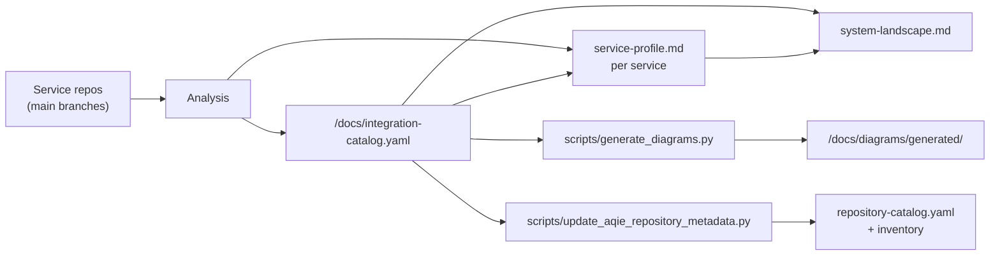

# Dynamic Update Workflow

## Principle

The integration catalogue is the source of truth. Repository metadata, diagrams and
`connected_services` are all derived from it or from the GitHub API. Prose is written last.



## End-to-end process

Precondition: `DEFRA_READONLY_PAT` is configured, or `gh` is authenticated locally.

1. **Refresh metadata** — run `update_aqie_repository_metadata.py`. New repositories are
   discovered automatically via the GitHub search API.
2. **Find deltas** — compare each repository's `origin/main` HEAD with its
   `last_analysed_main_commit`.
3. **Analyse changed repositories** — clone shallow outside the workspace and establish
   routes, outbound calls, environment variable names, data stores, hosting and structure.
4. **Update the integration catalogue** — add, amend or refute edges with evidence.
5. **Update service profiles** for changed repositories.
6. **Update domain overviews and the system landscape.**
7. **Regenerate diagrams** — run `generate_diagrams.py`.
8. **Update the draw.io poster** if the structural picture changed materially.
9. **Record the run** in the audit log, and any new findings in the security findings file.

## Main-branch delta rule

- Analyse `main` only.
- Ignore feature branches, draft work and unmerged pull requests.
- Analysis window per repository:
  - Start: `last_analysed_main_commit`, or the initial baseline if null
  - End: current `origin/main` HEAD

## Commands

```bash
GITHUB_TOKEN=$(gh auth token) python3 scripts/update_aqie_repository_metadata.py
python3 scripts/generate_diagrams.py
```

Both require `PyYAML`.

## Completion criteria

- All changed repositories have refreshed profiles
- Integration catalogue reflects reality, including disproved edges under `refuted_edges`
- Generated diagrams regenerated and committed
- System landscape aligned with per-service changes
- Audit log updated
- New security or information governance findings recorded

## What not to do

- Do not hand-edit anything under `/docs/diagrams/generated/`.
- Do not infer `connected_services` from repository names.
- Do not record secret values, only variable names.
- Do not treat a configuration key as an integration without confirming a call site exists.
